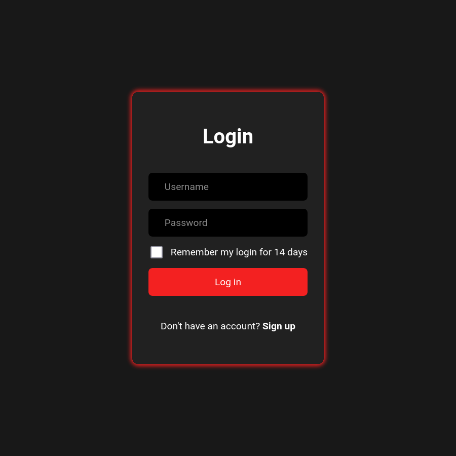
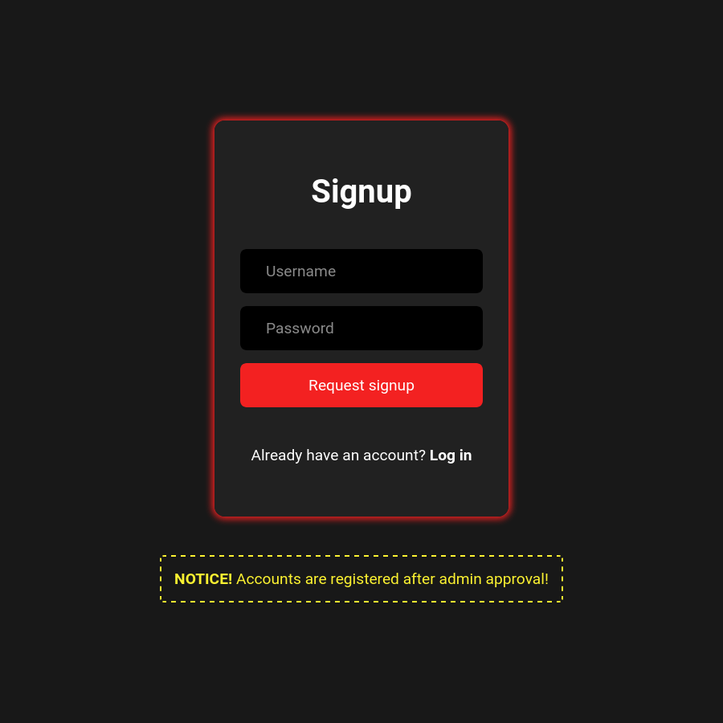

# LightsOnCNU

## Introducere

LightsOnCNU este o aplicație creată pentru a permite utilizatorilor ei să controleze diferite echipamente în timp real, într-un mod securizat, rapid și prietenos cu utilizatorul.

Aplicația se adresează oricui dorește să aibă posibilitatea de a porni și opri orice sistem electronic sau electric. Prin aceasta ne referim la:
- sonerii, difuzoare, boxe
- LED-uri, becuri, lumini de studio
- unități AC, boilere, centrale termice, pompe
- aspersoare pentru irigat
- orice priză electrică, care, prin această aplicație, devine o priză inteligentă;
- etc.

Acest proiect folosește PLC-uri [Arduino Opta](https://www.arduino.cc/pro/hardware-arduino-opta/), echipate cu relee de mare putere și un server care controlează aceste PLC-uri printr-un *protocol de comunicare dezvoltat de noi*. Totodată, serverul găzduiește un site web ce funcționează ca un intermediar între utilizatori și PLC-uri.

**Notă**: În continuare, ne vom referi la controlul releelor ce aparțin de unitățile Arduino Opta, însă închiderea/deschiderea circuitului prin releu are ca efect pornirea/oprirea dispozitivului ales.

## Funcționalitățile aplicației
- Închiderea/deschiderea unui releu, atât prin intermediul dashboard-ului cât și prin întrerupătoare cu revenire
- Actualizarea în timp real a stării releelor ce au fost închise/deschise de la un întrerupător
- Blocarea/deblocarea unui releu, astfel încât acesta nu mai poate fi controlat de la întrerupător, ci doar de pe website
- Afișarea stării fiecărui PLC Arduino Opta (*reachable*/*unreachable*)
- Afișarea datei și orei la care serverul a bootat
- Sistem de înregistrare și autentificare
- Sistem de autorizare, în funcție de *role*-ul contului autentificat: utilizator sau administrator
- Schimbarea numelui de utilizator, a parolei
- Delogare de pe toate dispozitivele sau de pe dispozitivul curent
- Exclusiv contului de administrator:
    - Pagină web dedicată configurării denumirii releelor și a categoriilor în care acestea vor fi grupate în pagina de dashboard
    - Pagină web pentru aprobarea sau respingerea cererilor de înregistrare (signup), astfel că un cont nou poate fi creat doar cu acordul administratorului
- Mecanisme de prevenție împotriva atacurilor precum SQL injection, XSS, CSRF, clickjacking, auth bruteforcing, timing attack, replay attack și alte vulnerabilități

## Screenshot-uri

TODO

## Proiectare

Codul pentru PLC-uri a fost scris în Arduino IDE, iar codul pentru server folosește runtime-ul Node.js.

Întreg codul proiectului este scris pentru a fi ușor de înțeles și dovedește cunoașterea paradigmelor de programare funcțională și a principiilor OOP. De exemplu, am creat clasa `ArduinoOpta` pentru a abstractiza fiecare dispozitiv de acest tip.

Costurile de performanță sunt foarte scăzute, astfel că serverul poate rula practic pe orice computer.

Aplicația are două componente principale:
- protocolul de comunicare între server și PLC-uri
- site-ul web ce oferă utilizatorilor finali o interfață plăcută și ușor de utilizat

Aceste două componente sunt *loosely coupled*, adică slab cuplate între ele, deci vor fi tratate separat.

## Protocolul de comunicare

Unde găsesc codul?
- Folderul `arduino_opta` conține toate fișierele sketch-ului ce va fi încărcat pe PLC-ul Arduino Opta
- Folderul `server/arduinoOpta` conține:
    - subfolderul `comm` cu toate fișierele protocolului de comunicare
    - alte fișiere, de exemplu wrappere pentru a facilita trimiterea mesajelor

Ne-am dorit să creăm un protocol ce ar permite primirea și trimiterea mesajelor între server și PLC-uri, asigurând:
- confidențialitatea mesajului, mesajul fiind imposibil de înțeles pentru o a 3-a persoană
- autenticitatea mesajului, adică acesta și-a păstrat integritatea și nu a fost modificat, iar autorul mesajului poate fi verificat

Am creat un protocol bidirecțional de comunicare, bazat pe [AES](https://en.wikipedia.org/wiki/Advanced_Encryption_Standard)-256-[CBC](https://en.wikipedia.org/wiki/Block_cipher_mode_of_operation) pentru criptarea mesajului și pe [HMAC](https://en.wikipedia.org/wiki/HMAC)-SHA256 pentru a dovedi autenticitatea mesajului. În acest mod, am obținut aspectele menționate în paragraful anterior și am realizat un protocol securizat.

Acest protocol este un element **distinctiv** al proiectului nostru, un punct forte. Aspecte cheie includ atingerea unui nivel maxim de securitate, folosirea responsabilă a resurselor sistemului și facilitarea extinderii acestuia.

Mesajele sunt transmise prin socket-uri TCP. PLC-urile primesc mesaje pe port-ul `9090`, în timp ce serverul folosește port-ul `9091` pentru a primi mesaje de la dispozitive Arduino.

Codul pentru Arduino utilizează următoarele implementări ale unor algoritmi criptografici pentru a asigura funcționarea protocolului de comunicare:
- [kokke/tiny-AES-c](https://github.com/kokke/tiny-AES-c)
- [h5p9sl/hmac_sha256](https://github.com/h5p9sl/hmac_sha256)

Serverul folosește pachetul [Crypto](https://nodejs.org/api/crypto.html) pentru funcțiile AES și HMAC.

### Mesaje

În C++, am definit următoarele structuri pentru a reprezenta mesajele trimise de Arduino și pe cele trimise de Server:

```c++
// mesaj trimis de către un PLC Arduino Opta
struct ArduinoMessage {
    uint32_t counter;       // contorul mesajului
    uint32_t timestamp;     // timpul Unix la momentul trimiterii
    uint8_t arduino_id;     // ID-ul PLC-ului
    uint8_t type;           // tipul mesajului
    uint8_t extra_field;    // câmp extra (vezi mai jos)
} __attribute__((packed));

// mesaj trimis de către server
struct ServerMessage {
    uint32_t counter;
    uint32_t timestamp;
    uint8_t type;
    uint8_t extra_field;
} __attribute__((packed));
```

Structurile au atributul `packed` deoarece compilatoarele C/C++ inserează baiți în plus între câmpurile structurilor, pentru a "alinia" adresele din memorie ale câmpurilor și a crește performanța atunci când memoria este accesată. [Wikipedia](https://en.wikipedia.org/wiki/Data_structure_alignment).

În acest caz, ne dorim un șir de baiți consecutivi pentru a facilita serializarea și deserializarea mesajelor, fără baiți de aliniament:
- în C++, prin cast-ul unui array de tipul `uint8_t[]` la una dintre structurile definite mai sus și viceversa
- în Node.js, folosind clasa [`Buffer`](https://nodejs.org/api/buffer.html)

Tipurile mesajelor sunt definite în felul următor:
```c++
enum ArduinoMessageType {
    // acest mesaj este trimis atunci când un întrerupător este acționat
    // și va transmite noile stări ale releelor către server
    ARDUINO_SET_RELAY_STATES = 0
};

enum ServerMessageType {
    // închiderea/deschiderea unui releu prin intermediul dashboard-ului,
    // se va comunica PLC-ului Arduino Opta pentru a efectua comanda,
    // prin trimiterea acestui mesaj
    SERVER_SET_RELAY_STATES = 0,
    // blocarea/deblocarea unui releu prin intermediul dashboard-ului,
    // se va comunica PLC-ului Arduino Opta
    // pentru a dezactiva controlul releului de la întrerupător
    SERVER_SET_RELAY_LOCKS = 1
};
```
| Denumire Câmp | Valoare |
| ------------- | --- |
| `type` | are una dintre valorile menționate imediat mai sus |
| `extra` | depinde de valoarea câmpului `type`: <ul><li> în cazul unui mesaj trimis pentru a actualiza starea releelor, bit-ul `N` al acestui câmp va reprezenta starea releului `N`, în felul următor: 0 = circuit deschis și 1 = circuit închis. Fiecare PLC Arduino Opta dispune de 4 relee, deci acest câmp folosește doar 4 biți din byte-ul întreg</li><li>similar, în cazul mesajelor de tip `SERVER_SET_RELAY_LOCKS`, vom folosi 4 biți pentru a comunica PLC-ului care dintre cele 4 relee sunt blocate, 0 = releu deblocat și 1 = releu blocat</li></ul> |
| `counter` | numărul mesajelor trimise până la momentul creării mesajului |
| `timestamp` | timpul local în format Unix de la momentul creării mesajului |
| `arduino_id` | prezent doar în cadrul unui mesaj trimis de către un PLC; reprezintă ID-ul PLC-ului care a trimis mesajul |

În Node.js protocolul este același, iar singurele diferențe sunt sintaxa și (de)serializarea mesajelor, realizată utilizând clasa `Buffer`, de exemplu:

```js
class ArduinoMessage {
    #counter;    // 4 baiți
    #timestamp;  // 4 baiți
    #arduinoId;  // 1 bait
    #type;       // 1 bait
    #extraField; // 1 bait

    constructor(buffer) {    // deserializarea unui mesaj primit sub formă de Buffer
        this.#counter    = buffer.readUInt32LE(0); // 0
        this.#timestamp  = buffer.readUInt32LE(4); // +4
        this.#arduinoId  = buffer.readUInt8(8);    // +4
        this.#type       = buffer.readUInt8(9);    // +1
        this.#extraField = buffer.readUInt8(10);   // +1
    }

    getCounter() { return this.#counter }
    // getTimestamp() { return ...
}
```

### Crearea unui mesaj

Vom considera drept exemplu următorul mesaj `ArduinoMessage` și cast-ul acestuia la un array de baiți:

```c++
struct ArduinoMessage arduino_msg = {
    // drept exemplu, am considerat următoarele valori:
    .counter = 1932,
    .timestamp = 1714576902,
    .arduinoId = 2,
    .type = ARDUINO_SET_RELAYS,
    .extra = 0b1101
};

uint8_t *byte_array = (uint8_t *) &arduino_msg;
```

Valorile din `byte_array` sunt `8c 07 00 00 06 5e 32 66 02 00 0d`.

**Notă**: Ordinea de transmitere a baiților este **little-endian**. Citește mai mult despre [endianness](https://en.wikipedia.org/wiki/Endianness).

Câmpul `counter` este reprezentat de primii 4 baiți, `8c 07 00 00`.

Câmpul `timestamp` este reprezentat de următorii 4 baiți: `06 5e 32 66`.

După primii 8 baiți, urmează baiții `02 00 0d`, ce reprezintă, în această ordine:
- ID-ul PLC-ului Arduino ce a trimis mesajul, aici `0x2` = 2
- Tipul mesajului, aici `0x0` = `ARDUINO_SET_RELAY_STATES`
- Valorea câmpului extra, aici `0xd` = `0b00001101` (releu 0 - circuit închis, releu 1 - circuit deschis, ...)

### Trimiterea unui mesaj

Cheile criptografice ale algoritmilor AES și HMAC sunt pre-shared. Lungimea cheii AES este 32 de baiți, iar lungimea cheii HMAC este 64 de baiți.

Folosim metoda **Encrypt-then-MAC**. Astfel, obținem simultan confidențialitate (mesajul este criptat, indescifrabil) și autenticitate. [Citește mai mult](https://crypto.stackexchange.com/a/205).

1. Construim mesajul pe care vrem să îl transmitem și îl convertim într-un șir de baiți.
2. AES criptează date în block-uri de câte 16 baiți, așa că mesajele trebuie mai întâi aduse la o dimensiune, în baiți, multiplu de 16. În acest sens, am folosit standardul [PCKS#7](https://www.ibm.com/docs/en/zos/2.4.0?topic=rules-pkcs-padding-method).
3. Pentru modul CBC al algoritmului AES, avem nevoie și de un IV (initialization vector), pe care îl generăm cu funcția `rand()` în C++ și funcția `randomBytes()` din pachetul [Crypto](https://nodejs.org/api/crypto.html#cryptorandombytessize-callback) în Node.js.
4. Criptăm șirul de baiți prin algoritmul AES, folosind cheia pre-shared și IV-ul generat anterior.
5. Pentru calcularea MAC-ului (Message Authentication Code), folosim algoritmul HMAC-SHA256. Acesta are ca date de intrare șirul de baiți obținut prin concatenarea IV-ului și a mesajului criptat prin AES.
6. Concatenăm, în această ordine: IV-ul, mesajul criptat prin AES și hash-ul generat.

<details>
<summary>Exemplu de transmitere</summary>

Pe exemplul precedent, criptând mesajul `plaintext` = `8c070000065e326602000d` cu:
- `iv` = `73a42edf0df1a14e0dcba9c509efa2e9`
- `aes_key` = `28346c9c5a9f30b2e560f6e66ce2be5b0ffe2108608156e8c15ec71602dd908a`

obținem criptarea `ciphertext` = `576c9076848c1534b4c826c2faaac492`.

Urmează să calculăm hash-ul pentru a garanta autenticitatea mesajului când el va fi decriptat.

Funcția HMAC-SHA256 va primi ca date de intrare baiții `iv || ciphertext`, adică șirul de baiți format prin concatenarea IV-ului și a mesajului criptat.

Folosim cheia HMAC-SHA256 `hmac_key` = `71cfdc3e0689a81d7e2bb53f51bd777fc403efbccb79ec528ad0abbdfe686383ec16e8a63d20137c426e452c97cd6c4d699beb38aff4b84dc4a21cfe087a2320`.

Obținem hash-ul `hash` = `fee1fd8a2582c587a676ef7003b1490f68a107839594c70aba727145c97cc035`

Acum putem transmite șirul de baiți `out` = `iv || ciphertext || hash` către server.

</details>

### Validarea unui mesaj primit

Contorizăm numărul mesajelor primite până la momentul actual.

1. Se verifică ca lungimea mesajului să fie multiplu de 16 baiți.

2. Se fragmentează mesajul în felul următor:
- primii 16 baiți = `iv`
- ultimii 32 baiți = `received_hash`
- restul baiților = `ciphertext`

3. Calculăm hash-ul pentru `iv || ciphertext` și verificăm egalitatea dintre acesta și `received_hash`, pentru a dovedi autenticitatea mesajului.

    Notă: Comparând hash-ul calculat și cel primit, au fost folosite funcții timing-safe pentru a nu face protocolul vulnerabil unui [timing attack](https://en.wikipedia.org/wiki/Timing_attack).

4. Decriptăm mesajul, folosind cheia AES pre-shared și `iv`-ul primit.

5. Câmpul `counter` al mesajului trebuie să fie strict mai mic decât contorul mesajelor primite

6. Modulul diferenței dintre timpul local de la momentul primirii și câmpul `timestamp` trebuie să fie de cel mult 5 secunde.

    La primirea unui mesaj, validarea câmpurilor `counter` și `timestamp` asigură protecție împotriva unui [replay attack](https://en.wikipedia.org/wiki/Replay_attack).

    Notă: Deși mesajul este creat și apoi primit, așadar diferența ar trebui să fie pozitivă ori nulă, datorită inacurateții RTC-ului PLC Arduino Opta, am dedus experimental că această diferență poate fi și negativă, în jur de -2 secunde. Calibrăm RTC-ul la un interval de timp mai mic și calculăm *modulul* diferenței pentru a rezolva această problemă.

7. Orice verificare eșuată înseamnă ignorarea mesajului, considerându-l invalid. Dacă toate condițiile au fost îndeplinite, mesajul este valid și acum poate fi considerat sigur. **NU** uităm să incrementăm contorul mesajelor primite.

## Website-ul

### Unde găsesc codul?
- folderul `server/express` unde se află website-ul
- fișierul `server/socketIo.js` conține serverul Socket.IO
- fișierul `server/main.js` care cuplează website-ul, serverul Socket.IO și protocolul de comunicare

### Tehnologii
Pentru realizarea website-ului am folosit următoarele tehnologii și pachete:
- [Node.js](https://nodejs.org/en), un mediu de rulare pentru JavaScript, async, event-based
- [Express](https://expressjs.com/), un framework pentru aplicații web
- [EJS](https://ejs.co/), un template engine pentru a genera markup HTML, pe care l-am folosit pentru a refolosi părțile din website care se repetă (de ex. header-ul paginii) și pentru a genera conținut dinamic
- [MariaDB Node.js connector](https://github.com/mariadb-corporation/mariadb-connector-nodejs?tab=readme-ov-file), un client MySQL și MariaDB pentru Node.js, async, non-blocking
- [Socket.IO](https://socket.io/), o bibliotecă ce asigură comunicare în timp real, cross-platform, pe care am folosit-o exclusiv pentru pagina de dashboard

Pe lângă tehnologiile principale, Node.js, Express, EJS, MariaDB și Socket.IO, am utilizat și:
- [bcrypt](https://www.npmjs.com/package/bcrypt), o bibliotecă pentru a transforma parolele utilizatorilor în hash-uri sigure
- [cookie-parser](https://www.npmjs.com/package/cookie-parser), parser de cookie-uri pentru Express
- [dotenv](https://www.npmjs.com/package/dotenv), un pachet ce încarcă variabilele de mediu din fișierul .env
- [express-validator](https://express-validator.github.io/docs), un pachet ce conține o colecție de funcții folosite pentru a valida datele trimise de utilizator
- [helmet](https://github.com/helmetjs/helmet), un pachet ce ajută la securizarea aplicațiilor web bazate pe Express, setând header-uri HTTP la răspuns (CSP, CORS, HSTS, etc.)
- [luxon](https://www.npmjs.com/package/luxon), bibliotecă folosită pentru lucrul cu date și timp în JavaScript
- [uuid](https://www.npmjs.com/package/uuid), pentru a crea UUID-uri (ID-uri unice)

### Baza de date

Website-ul folosește o bază de date aflată pe un server MariaDB, iar structura acesteia poate fi importată din fișierul `db_structure.sql`. Am creat un *database pool* pentru a reduce *overhead*-ul la executarea interogărilor. Biblioteca folosită pentru conectarea la baza de date protejează împotriva atacurilor de tipul *SQL Injection*.

Cele 4 tabele din baza de date sunt, după cum urmează

---
Tabelul `users` conține datele fiecărui utilizator:
| Nume | Valoare | Tip |
| ---- | ------- | --- |
| user | numele utilizatorului | VARCHAR(31), PRIMARY KEY
| passHash | hash-ul parolei utilizatorului | VARCHAR(63) |
| role | *role*-ul utilizatorului, *user* sau *admin* | VARCHAR(15) |
---

Tabelul `sessions` conține datele fiecărei sesiuni asociate unui utilizator:
| Nume | Valoare | Tip |
| ---- | ------- | --- |
| sessionId | ID-ul sessiuni | CHAR(36), PRIMARY KEY |
| user | numele utilizatorului asociat sesiunii | VARCHAR(31) |
| expire | data și ora de expirare a sesiunii | DATETIME |

Sesiunile care au expirat sunt șterse din baza de date folosind un *event* ce se execută odată la 60 de secunde:

```sql
DELETE FROM `sessions` WHERE `expire` < NOW()
```

Acesta este configurat în serverul MariaDB, cu mențiunea că event scheduler-ul trebuie setat să pornească odată cu serverul MariaDB.

---

Tabelul `signup_requests` conține toate cererile de înregistrare care trebuie aprobate de un administrator:
| Nume | Valoare | Tip |
| ---- | ------- | --- |
| user | numele utilizatorului | VARCHAR(31), PRIMARY KEY |
| passHash | hash-ul parolei utilizatorului | VARCHAR(63) |
| requestDate | data la care a fost înregistrată cererea de înscriere | DATETIME |
---

Tabelul `relays` conține configurația releelor PLC-urilor ce este afișată pe pagina de dashboard:
| Nume | Valoare | Tip |
| ---- | ------- | --- |
| relayId | ID-UL releului | INT(11), PRIMARY KEY |
| name | denumirea releului | VARCHAR(31) |
| category | categoria din care face parte releul, `LIGHTING` sau `OUTLET` | VARCHAR(15) |

În acest moment, website-ul suportă doar aceste două categorii, însă avem în plan extinderea codului astfel încât releele să poată fi grupate în categorii definite de administratori.

---

### Aplicația Express

Website-ul este responsive pentru orice rezoluție și are un aspect plăcut, modern, user-friendly.

Am configurat aplicația Express astfel încât să folosească engine-ul EJS. View-urile (paginile HTML) se află în folderul `server/express/views`, iar subfolderul `partials/` include anumite fragmente reutilizate deseori în cadrul site-ului.

Am ales să nu folosim soluții deja existente pentru management-ul sesiunilor web în Express, pentru că acestea au anumite dezavantaje și am optat pentru flexibilitate. Deci, am dezvoltat o schemă proprie.

Folosind un middleware, aplicația verifică prezența cookie-ului `sessionId` în orice cerere, iar dacă acesta este prezent, va interoga baza de date pentru a confirma că sesiunea nu este falsificată și că nu a expirat. În caz afirmativ, va considera mai departe că cererea vine de la un utilizator autentificat și va copia username-ul, data de expirare a sesiunii, role-ul, etc. în obiectul `req.session`, accesibil middleware-urilor ulterioare.

Notă: Aplicațiile Express funcționează ca o serie de apeluri către funcții middleware, executate în ordine. Middleware-ul descris mai sus este primul apelat din această serie. Mai departe, el dă controlul următoarei funcții, până când ciclul cerere-răspuns se încheie. [Pentru curioși](https://expressjs.com/en/guide/using-middleware.html).

Am definit trei funcții middleware, pe care le folosim pentru a restricționa accesul la anumite pagini în modul următor:
- `requireNoSession` - pagină disponibilă exclusiv utilizatorilor care nu sunt logați (ex. /login)
- `requireValidSession` - pagină disponibilă exclusiv utilizatorilor care sunt logați (ex. /dashboard)
- `requireAdminRole` - pagină disponibilă exclusiv administratorilor (ex. /configuration)

Vom detalia modul de funcționare a fiecărei pagini web.

Pagini accesibile utilizatorilor fără o sesiune validă:
<details>
<summary>/login</summary>

La apăsarea butonului *Log in*, browser-ul trimite o cerere POST către webserver cu username-ul și parola introduse. Serverul verifică existența username-ului în baza de date. Dacă username-ul există, utilizând biblioteca "bcrypt", va compara parola trimisă de utilizator cu hash-ul din baza de date.

Dacă combinația username și parolă este cea corectă, vom crea o sesiune nouă. Generăm un ID unic folosind biblioteca "uuid", username-ul asociat sesiunii va fi cel trimis de utilizator, iar sesiunea va avea o durată de viață de 8 ore, ori de 14 zile în cazul în care căsuța *Remember my login for 14 days* a fost bifată. Inserăm un rând nou în tabelul `sessions`. Apoi redirecționăm utilizatorul spre pagina de dashboard.

Dacă parola nu este cea corectă sau dacă utilizatorul nu există, vom seta cookie-ul `loginActionResult` cu valoarea `credentialsError` și vom redirecționa utilizatorul la pagina de login. La reîncărcarea paginii de login, vom detecta prezența cookie-ului și, folosind engine-ul EJS, vom afișa textul *Invalid username or password!*


</details>

<details>
<summary>/signup</summary>

Spre deosebire de o pagină de înregistrare tipică, unde un cont creat este activat imediat, această pagină doar crează o cerere de înregistrare nouă, urmând apoi ca un administrator să respingă (șteargă) cererea, ori să o accepte, făcând contul respectiv utilizabil, în sensul că utilizatorul se va putea loga cu acel cont.

La fel ca la pagina de login, apăsarea butonului *Request signup* va trimite o cerere POST către aplicația web, cu username-ul și parola din pagină. Mai departe, vom folosi biblioteca "express-validator" pentru a valida datele primite. Vom interoga baza de data pentru a verifica:
- existența unui cont cu username-ul ales, în tabelul `users`
- existența unei cereri de înregistrare cu username-ul ales, în tabelul `signup_requests`

Dacă există un cont, ori o cerere de înregistrare cu username-ul primit, atunci înregistrarea va fi respinsă. Similar schemei implementate pentru pagina de login, vom seta un cookie cu valoarea `userExistsError` și vom reîncărca pagina de signup. Template engine-ul EJS va afișa un mesaj informativ: *This user already exists!*

Dacă username-ul ales nu este deja folosit în vreun scop, vom crea un rând nou în tabelul `signup_requests`, unde coloana `user` va avea valoarea username-ului primit, iar coloana `passHash` va fi hash-ul parolei primite.



</details>

---

După logare, va exista o sesiune validă, astfel că utilizatorul va avea acces la paginile următoare:
<details>
<summary>/dashboard</summary>

Această pagină este, într-un sens, cea mai importantă, pentru că oferă utilizatorului posibilitatea de a controla în timp real releele de care dispun PLC-urile Arduino Opta. Pentru comunicarea în timp real, între server și clienți, am folosit biblioteca Socket.IO, o bibliotecă de comunicare bidirecțională *event-based*.

La încărcarea paginii web, serverul va transmite template engine-ului rândurile din tabelul `relays` al bazei de date, iar acesta va genera conținut dinamic folosind numele releului și plasându-l în categoria corespunzătoare, dacă (!) acesta există. Momentan aplicația web suportă doar două categorii, respectiv lighting (iluminare) și outlets (prize).

Tot la încărcarea paginii, browser-ul va încerca conectarea la serverul Socket.IO. Serverul va accesa cookie-urile primite și, exact ca la o pagină web, va verifica prezența cookie-ului `sessionId` și va executa interogări pentru a valida acest ID. Dacă sesiunea nu este validă, conexiunea va fi refuzată.

După ce are loc handshake-ul, serverul va trimite către clientul nou conectat starea sistemului de la momentul conectării:
- starea releelor (circuit închis/circuit deschis)
- blocarea releelor (ce relee sunt blocate/deblocate)
- starea PLC-urilor Arduino Opta (reachable/unreachable)

Pagina oferă butoane pentru a închide/deschide un releu, pentru a-l bloca/debloca și pentru a bloca toate releele, dezactivând astfel orice fel de control de la întrerupător.

Reminder: Un releu poate fi închis sau deschis și de la întrerupătoare conectate direct la PLC-uri, iar în acest caz PLC-urile Arduino Opta vor transmite un mesaj către server pentru a comunica schimbarea ce trebuie efectuată și pe pagina web.

Când un utilizator efectuează o schimbare (de ex. închide un releu), serverul, folosind protocolul de comunicare explicat anterior, comunică aceste schimbări PLC-urilor Arduino Opta, prin *mesaje*.

Comunicarea prin intermediul bibliotecii Socket.IO se face pe baza următoarelor event-uri:

| Nume Event | Rol |
| ---------- | --- |
| `server-setInitialState` | serverul setează starea sistemului la momentul conectării unui nou client, actualizând astfel conținul paginii web |
| `server-setRelayStates` | serverul setează starea releelor; transmis tuturor clienților atunci când un utilizator închide/deschide un releu și ceilalți clienți trebuie să actualizeze și ei pagina web; transmis de asemenea tururor clienților atunci când un releu este închis/deschis de la un întrerupător |
| `server-setRelayLocks` | serverul setează starea de blocare a fiecărui releu; transmis tuturor clienților atunci când un utilizator închide/deshide un releu |
| `server-setRelayLockAll` | serverul setează toate releele ca blocate și transmite că butonul de blocare a tuturor releelor trebuie să fie activ; transmis atunci când un utilizator blochează/deblochează toate releele; la dezactivarea funcției ce blochează toate releele nu se vor debloca toate releele, ci sistemul va reveni la starea anterioară activării funcției.
| `client-setRelayState` | un client setează starea unui releu; transmis către server |
| `client-setRelayLock` | un client setează blocarea unui releu; transmis către server |
| `client-setRelayLockAll` | un client activează funcția ce blochează/deblochează toate releele; transmis către server |

</details>

<details>
<summary>/change-username</summary>
</details>

<details>
<summary>/change-password</summary>
</details>

---

Pe lângă acestea există și două butoane, folosite pentru a deconecta utilizatorul de pe orice dispozitiv, ori pentru a-l deconecta de pe dispozitivul curent:
<details>
<summary>Revoke all sessions</summary>
</details>

<details>
<summary>Log out</summary>
</details>

---

În caz că utilizatorul este de fapt un administrator, accesta va putea accesa și paginile:
<details>
<summary>/configuration</summary>

Aplicația Express va afișa configurația actuală a releelor pe această pagină. Configurația poate fi editată, modificând numele sau categoria din care face parte pentru un releu sau mai multe. La apăsarea butonului *Submit Configuration*, browserul va face o cerere POST către webserver cu noua configurație. După validare, acesta va actualiza tabelul `relays` cu noua configurație și va reîncărca configurația din memorie. Noua configurație va fi vizibilă pe pagina dashboard.

</details>

<details>
<summary>/user-management</summary>

Pe această pagină, administratorii pot accepta sau șterge cereri de înregistrare a utilizatorilor. Reamintim că atunci când un utilizator se înregistrează, activarea contului se va face de către un administrator.

Dacă o cerere este respinsă, aceasta este pur și simplu ștearsă din tabelul `signup_requests`, iar dacă este aprobată, coloanele `user` și `passHash` sunt copiate într-un rând nou în tabelul `users`, iar coloana `role` va avea valoarea *user*, creând astfel un cont de utilizator. După copiere, cererea de înregistrare va fi ștearsă.

</details>

## Instalare

Pentru a obține o aplicație complet funcțională, este necesar cel puțin un PLC Arduino Opta, ce dispune de conectivitate Ethernet sau Wi-Fi.

Pasul 0. Înainte de clonarea repository-ului, este necesară instalarea următoarelor:
- Arduino IDE pentru încărcarea sketch-urilor pe PLC-uri
- Node.js, fiind runtime-ul pe care se bazează serverul
- Server MariaDB

Pasul 1. Clonează repository-ul proiectului și intră în acesta
```bash
git clone https://github.com/brickbotcnu/lights-on-cnu.git
cd lights-on-cnu/
```

Pasul 2. Creează o bază de date cu numele dorit (de ex. lights_on_cnu)

Pasul 3. Importă tabele și structura acestora în baza de date nou creată, folosind phpMyAdmin sau CLI
```bash
mariadb -u vasile -p lights_on_cnu < db_structure.sql
```

Pasul 4. Configurează IP-uri statice pentru server și pentru toate PLC-urile Arduino Opta.

Notă: Este recomandat ca PLC-urile și serverul să se afle în aceeași rețea locală (LAN). Pentru configurarea IP-urilor statice, MAC-ul PLC-urilor se poate obține urmând [acest tutorial](https://docs.arduino.cc/tutorials/opta/mac-address/).

Pasul 5. Generează chei criptografice pentru algoritmii AES și HMAC, de lungime de 32 de baiți, respectiv 64 de baiți. Asigură-te că folosești o sursă *truly random* și nu *pseudorandom*.

Pasul 6. Deschide sketch-ul din folderul `arduino_opta` în Arduino IDE.

Pasul 6.1. Copiază cheile generate la pasul 5 în fișierele `aes_key.h` și `hmac_key.h`.

Pasul 6.2. În fișierul `arduino_opta.ino`, setează constanta `ARDUINO_ID` la valoarea 0 pentru primul PLC, 1 pentru al doilea, 2 pentru al treilea, etc.

Pasul 6.3. Setează variabila `ip_addr` la adresa IP statică configurată pentru acel PLC.

Pasul 6.4. În fișierul `comm.h`, setează constanta `COMM_SERVER_IP` la IP-ul static al serverului.

Pasul 6.5. Încarcă sketch-ul pe fiecare PLC, modificând ID-ul și adresa IP pentru fiecare.

Pasul 7. Intră în subfolderul serverului
```bash
cd server/
```

Pasul 8. Configurează fișierul .env

| Variabilă | Valoare |
| --------- | ------- |
| HTTP_PORT | port-ul serverului HTTP
| HTTPS_ENABLED | yes/no, dezactivați această opțiune doar pentru testare, NU în producție 
| HTTPS_PORT | port-ul serverului HTTPS
| HTTPS_KEY_FILENAME | numele fișierului cu cheia privată pentru HTTPS |
| HTTPS_CERT_FILENAME | calea către fișierul cu certificatul semnat pentru HTTPS |
| DROP_PRIV | yes/no, renunță la privilegiile de root după atașarea serverelor HTTP(S) la porturi (binding) |
| DROP_PRIV_UID | UID-ul user-ului la care aplicația să revină |
| DROP_PRIV_GID | GID-ul user-ului la care aplicația să revină |
| COOKIE_SECRET | un secret criptografic de 32 de baiți ce trebuie generat |
| DB_HOST | host-ul bazei de date |
| DB_PORT | port-ul bazei de date |
| DB_USER | user-ul bazei de date |
| DB_PASS | parola pentru user-ul respectiv |
| DB_NAME | numele bazei de date create la pasul 2 |
| AES_KEY | cheia AES, generată la pasul 5 |
| HMAC_KEY | cheia HMAC, generată la pasul 5 |
| ARDUINO_OPTA_COUNT | numărul de PLC-uri Arduino Opta |
| ARDUINO_OPTA_IP_ADDRS | adresele IP statice ale PLC-urilor, separate prin spațiu |

Opțiunea `DROP_PRIV` este recomandată dacă este necesară utilizarea porturilor cu valori mai mici de 1024, unde este nevoie de drepturi de administrator (sudo). După port binding, aplicația poate reveni rula fără drepturi de administrator. De asemenea, este foarte recomandată utilizarea HTTPS. Un exemplu al fișierului .env este inclus în repository-ul proiectului. 

Pasul 9. Dacă folosești HTTPS (recomandat!), cheia privată și certificatul trebuie copiate în folderul `server/express/cert/`.

Pasul 10. Instalează dependințele serverului
```bash
npm install
```

Pasul 11. Alimentează PLC-urile și pornește serverul
```bash
npm start
```

Pasul 12. Done!

## Concluzie

Am realizat o aplicație modernă, durabilă, ușor de extins și prietenoasă, folosită din ianuarie 2024 cu succes de către departamentul tehnic al Colegiului Național „Unirea” Focșani, în cadrul numeroaselor evenimente ce au loc în acest colegiu. Aceasta s-a dovedit foarte utilă, aspect confirmat de voluntarii departamentului.

## Resurse externe

Pentru documentare, s-au folosit, în afara resurselor indicate în restul acestui fișier, următoarele:

Wikipedia:
- https://en.wikipedia.org/wiki/Message_authentication
- https://en.wikipedia.org/wiki/Authenticated_encryption
- https://en.wikipedia.org/wiki/HMAC
- https://en.wikipedia.org/wiki/Public-key_cryptography
- https://en.wikipedia.org/wiki/Digital_signature

Diverse:
- How do PHP sessions work (SO) https://stackoverflow.com/questions/1535697/how-do-php-sessions-work-not-how-are-they-used
- JWT are Dangerous for User Sessions https://redis.io/blog/json-web-tokens-jwt-are-dangerous-for-user-sessions/ - **worth reading!**
- Should You Use Express-Session for Your Production App? https://dzone.com/articles/should-you-use-express-session-for-your-production
- Securing Express https://gist.github.com/cerebrl/6487587
- Documentația Node.js https://nodejs.org/docs/latest/api/
- Tutorialele Arduino Opta https://docs.arduino.cc/hardware/opta/#tutorials
- How to persist event scheduler to be on even if MySQL is restarted (SO) https://stackoverflow.com/questions/20112395/how-to-persist-event-scheduler-to-be-on-even-if-mysql-is-restarted

Documentațiile tuturor pachetelor NPM folosite, dar mai ales:
- Express https://expressjs.com/en/api.html
- MariaDB connector https://github.com/mariadb-corporation/mariadb-connector-nodejs/blob/master/documentation/promise-api.md
- Socket.IO https://socket.io/docs/v4/
