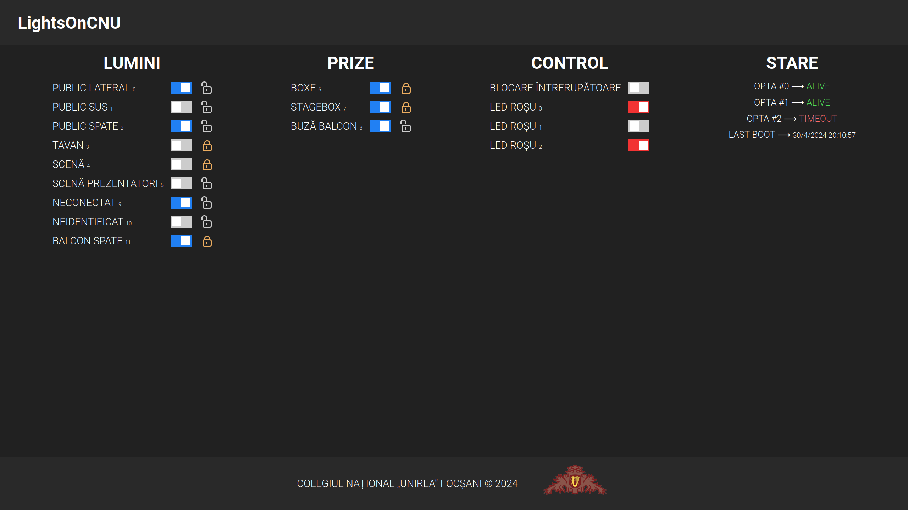
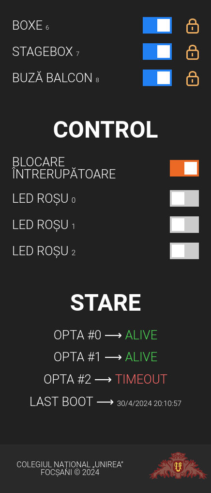

# LightsOnCNU - Powered by Viva Credit


LightsOnCNU este o aplicație web creată pentru a controla luminile din sala de festivități a Colegiului Național „Unirea” Focșani.

## De ce am creat acest proiect?

În sala de festivități a colegiului, controlul luminilor și al prizelor se realiza doar de la întrerupătoare. Totuși, amplasarea întrerupătoarelor îngreuna desfășurarea evenimentelor din sală. Aveam nevoie de o soluție portabilă care să ne ofere controlul deplin de la distanță.

## Soluția propusă

Am păstrat întrerupătoarele funcționale și ne-am folosit de [PLC](https://en.wikipedia.org/wiki/Programmable_logic_controller)-uri [Arduino Opta](https://www.arduino.cc/pro/hardware-arduino-opta/) cu capabilități Ethernet pentru a face posibil controlul luminilor și de la distanță. Am ales să folosim un Raspberry Pi pentru a hosta un site web și a oferi utilizatorilor o experiență interactivă. Acesta funcționează și ca server central ce controlează toate PLC-urile Arduino, printr-un protocol de comunicare creat de noi.

## Design





## Funcționalități
- Controlul luminilor și/sau al prizelor prin intermediul website-ului
- Actualizarea stărilor releelor pe website, atunci când un întrerupător este acționat
- Blocare/deblocare releu (iconița cu lacăt portocaliu) - releul nu mai poate fi închis sau deschis de la întrerupător, ci doar de persoanele care au acces la website
- Blocarea/deblocare tuturor releelor
- Website responsive pentru orice rezoluție și cu un aspect plăcut, modern
- Afișarea stării fiecărui PLC Arduino în timp real (online/offline)
- Afișarea datei și a orei la care serverul a bootat ultima oară

## Proiectare

Pentru comunicarea dintre Server și Arduino, am realizat o rețea locală la care am conectat, prin Ethernet, Raspberry Pi-ul și toate dispozitivele Arduino. De asemenea, am configurat IP-uri statice în setările serverului DHCP. Am creat un protocol bidirecțional de comunicare, bazat pe [AES](https://en.wikipedia.org/wiki/Advanced_Encryption_Standard)-256-[CBC](https://en.wikipedia.org/wiki/Block_cipher_mode_of_operation) pentru criptarea mesajului și pe [HMAC](https://en.wikipedia.org/wiki/HMAC)-SHA256 pentru a dovedi autenticitatea mesajului, realizând în acest mod un protocol sigur. Datele criptate sunt transmise prin socket-uri TCP. PLC-urile primesc date pe port-ul `9090`, în timp ce Serverul folosește port-ul `9091` pentru a primi mesaje de la dispozitive Arduino.

Codul pentru Arduino utilizează următoarele implementări ale unor algoritmi criptografici pentru a asigura funcționarea protocolului de comunicare:
- [kokke/tiny-AES-c](https://github.com/kokke/tiny-AES-c)
- [h5p9sl/hmac_sha256](https://github.com/h5p9sl/hmac_sha256)

Serverul este scris în Node.js și folosește următoarele tehnologii:
- [Express](https://expressjs.com/) pentru webserver
- [Socket.IO](https://socket.io/) pentru comunicarea în timp real dintre webserver și utilizatorii web
- Modulul Node.js [net-ping](https://www.npmjs.com/package/net-ping), folosit pentru a verifica dacă PLC-urile pot fi accesate din rețeaua locală

Întreg codul proiectului este scris pentru a fi ușor de înțeles și dovedește cunoașterea paradigmelor de programare funcțională și a principiilor OOP. Spre exemplu, am creat clasa `ArduinoOpta` pentru a abstractiza fiecare dispozitiv de acest tip.

Costurile de performanță sunt foarte scăzute, astfel că serverul poate rula practic pe orice computer.

## Instalare

Descarcă și instalează [Node.js](https://nodejs.org/en/download), dacă acesta nu este instalat

1. Clonează repository-ul proiectului
```bash
git clone https://github.com/brickbotcnu/lights-on-cnu.git
```

2. Intră în folderul serverului
```bash
cd lights-on-cnu/server/
```

3. Instalează modulele necesare
```bash
npm i express socket.io net-ping
```

4. Pornește serverul
```bash
node main.js
```

Webserverul poate fi accesat la adresa [http://localhost:8080/](http://localhost:8080/)

Notă: Modulul `net-ping` necesită drepturi de administrator.

## Protocolul de comunicare

Acest protocol este un element **distinctiv** al proiectului nostru și totodată un punct forte. Aspecte cheie includ atingerea unui nivel maxim de securitate, folosirea responsabilă a resurselor sistemului și facilitarea extinderii acestuia.

### Mesaje

În C++, am definit următoarele structuri pentru a reprezenta mesajele trimise de Arduino și pe cele trimise de Server:

```c++
struct ArduinoMessage {  // mesaj trimis de PLC-ul Arduino Opta
    uint32_t counter;    // contor al mesajului
    uint32_t timestamp;  // timpul Unix la momentul trimiterii
    uint8_t arduino_id;  // ID-ul PLC-ului
    uint8_t type;        // tip mesaj
    uint8_t extra_field; // câmp extra
} __attribute__((packed));

struct ServerMessage {   // mesaj trimis de Server
    uint32_t counter;
    uint32_t timestamp;
    uint8_t type;
    uint8_t extra_field;
} __attribute__((packed));
```

Structurile au atributul `packed` deoarece compilatoarele C/C++ inserează baiți în plus între câmpurile structurilor, pentru a "alinia" adresele din memorie ale câmpurilor și a crește performanța atunci când memoria este accesată. [Wikipedia](https://en.wikipedia.org/wiki/Data_structure_alignment).

În acest caz, ne dorim un șir de baiți consecutivi pentru a facilita serializarea și deserializarea mesajelor, fără baiți de aliniament:
- în C++, prin cast-ul unui array de tipul `uint8_t[]` la una dintre structurile definite mai sus și viceversa
- în Node.js, folosind clasa [`Buffer`](https://nodejs.org/api/buffer.html)

Tipurile mesajelor sunt definite în felul următor:
```c++
enum ArduinoMessageType {
    // noile stări ale releelor ce controlează luminile
    ARDUINO_SET_RELAYS = 0
};

enum ServerMessageType {
    // dacă un utilizator pornește/oprește un releu de pe website,
    // PLC-ul Arduino Opta trebuie înștiințat pentru a efectua schimbarea
    SERVER_SET_RELAYS = 0,
    // blocarea unui întrerupător, pentru a preveni acționarea
    // accidentală în timpul unui eveniment
    SERVER_SET_LOCKS = 1
};
```

Câmpul `type` va avea una dintre valorile menționate imediat mai sus.

Câmpul `extra` depinde de valoarea câmpului `type`. În cazul unui mesaj de natură a seta starea releelor, bit-ul `N` al acestui câmp va reprezenta starea releului `N`, astfel, 0 = circuit deschis și 1 = circuit închis. Fiecare PLC Arduino Opta dispune de 4 relee, deci acest câmp folosește doar 4 biți din byte-ul întreg. Similar, în cazul mesajelor de tip `SERVER_SET_LOCKS`, vom folosi 4 biți pentru a comunica PLC-ului starea de blocare a celor 4 relee, 0 = releu deblocat și 1 = releu blocat.

Câmpul `counter` reprezintă numărul mesajelor trimise până la momentul creării mesajului, urmând ca după trimitere variabila locală să fie incrementată cu o unitate.

Câmpul `timestamp` este timpul local în format Unix de la momentul creării mesajului.

Câmpul `arduino_id` este prezent doar în cadrul unui mesaj trimis de Arduino și reprezintă ID-ul PLC-ului care a trimis mesajul.

În Node.js protocolul este același, iar singurele diferențe sunt sintaxa și (de)serializarea mesajelor, realizată utilizând clasa `Buffer`, de exemplu:

```js
class ArduinoMessage {
    #counter;    // 4 baiți
    #timestamp;  // 4 baiți
    #arduinoId;  // 1 bait
    #type;       // 1 bait
    #extraField; // 1 bait

    constructor(buffer) {    // deserializarea unui mesaj primit sub formă de Buffer
        this.#counter    = buffer.readUInt32LE(0); // 0
        this.#timestamp  = buffer.readUInt32LE(4); // +4
        this.#arduinoId  = buffer.readUInt8(8);    // +4
        this.#type       = buffer.readUInt8(9);    // +1
        this.#extraField = buffer.readUInt8(10);   // +1
    }

    getCounter() { return this.#counter }
    /* getTimestamp(), getArduinoId(), ... */
}
```

### Crearea unui mesaj

Vom considera drept exemplu următorul mesaj `ArduinoMessage` și cast-ul acestuia la un array de baiți:

```c++
struct ArduinoMessage arduino_msg = {
    // aceste câmpuri sunt, în practică, setate dinamic
    // drept exemplu, am considerat următoarele valori:
    .counter = 1932,
    .timestamp = 1714576902,
    .arduinoId = 2,
    .type = ARDUINO_SET_RELAYS,
    .extra = 0b1101
};

uint8_t *byte_array = (uint8_t *) &arduino_msg;
```

Valorile din `byte_array` sunt `8c 07 00 00 06 5e 32 66 02 00 0d`.

**Notă**: Ordinea de transmitere a baiților este **little-endian**. Citește mai mult despre [endianness](https://en.wikipedia.org/wiki/Endianness).

Câmpul `counter` este reprezentat de primii 4 baiți, `8c 07 00 00`.

Câmpul `timestamp` este reprezentat de următorii 4 baiți: `06 5e 32 66`.

După primii 8 baiți, urmează baiții `02 00 0d`, ce reprezintă, în această ordine:
- ID-ul PLC-ului Arduino ce a trimis mesajul, aici `0x2` = 2
- Tipul mesajului, aici `0x0` = `ARDUINO_SET_RELAYS`
- Valorea câmpului extra, aici `0xd` = `0b00001101` (releul 0 închis, releul 1 deschis, ... releul `N` - bit-ul `N`)

## Trimiterea unui mesaj

Cheile criptografice ale algoritmilor AES și HMAC sunt pre-shared.

Folosim metoda **Encrypt-then-MAC**. Astfel, obținem simultan confidențialitate (mesajul este criptat, indescifrabil) și autenticitate. [Citește mai mult](https://crypto.stackexchange.com/a/205).

1. Construim mesajul pe care vrem să îl transmitem și îl convertim într-un șir de baiți.
2. AES criptează date în block-uri de câte 16 baiți, așa că mesajele trebuie mai întâi aduse la o dimensiune, în baiți, multiplu de 16. În acest sens, am folosit standardul [PCKS#7](https://www.ibm.com/docs/en/zos/2.4.0?topic=rules-pkcs-padding-method).
3. Pentru modul CBC al algoritmului AES, avem nevoie și de un IV (initialization vector), pe care îl generăm cu funcția `rand()` în C++ și funcția `randomBytes()` din biblioteca [Crypto](https://nodejs.org/api/crypto.html#cryptorandombytessize-callback) în Node.js.
4. Criptăm șirul de baiți prin algoritmul AES, folosind cheia pre-shared și IV-ul generat anterior.
5. Pentru calcularea MAC-ului (Message Authentication Code), folosim algoritmul HMAC-SHA256. Acesta are ca date de intrare șirul de baiți obținut prin concatenarea IV-ului și a mesajului criptat.
6. Trimitem șirul de baiți format din: IV, mesajul criptat prin AES și MAC.

<details>
<summary>Exemplu de criptare</summary>

Pe exemplul precedent, criptând mesajul `plaintext` = `8c070000065e326602000d` cu:
- `iv` = `73a42edf0df1a14e0dcba9c509efa2e9`
- `aes_key` = `28346c9c5a9f30b2e560f6e66ce2be5b0ffe2108608156e8c15ec71602dd908a`

obținem criptarea `ciphertext` = `576c9076848c1534b4c826c2faaac492`.

Urmează să calculăm hash-ul pentru a garanta autenticitatea mesajului când el va fi decriptat.

Funcția HMAC-SHA256 va primi ca date de intrare baiții `iv || ciphertext`, adică șirul de baiți format prin concatenarea IV-ului și a mesajului criptat.

Folosim cheia HMAC-SHA256 `hmac_key` = `71cfdc3e0689a81d7e2bb53f51bd777fc403efbccb79ec528ad0abbdfe686383ec16e8a63d20137c426e452c97cd6c4d699beb38aff4b84dc4a21cfe087a2320`.

Obținem hash-ul `hash` = `fee1fd8a2582c587a676ef7003b1490f68a107839594c70aba727145c97cc035`

Acum putem transmite șirul de baiți `out` = `iv || ciphertext || hash` către Server.

</details>

### Validarea unui mesaj primit

Contorizăm numărul mesajelor primite până la momentul actual.

1. Se verifică ca lungimea mesajului să fie multiplu de 16 baiți.

2. Se fragmentează mesajul în felul următor:
- primii 16 baiți = `iv`
- ultimii 32 baiți = `received_hash`
- restul baiților = `ciphertext`

3. Calculăm hash-ul pentru `iv || ciphertext` și verificăm egalitatea dintre acesta și `received_hash`, pentru a dovedi autenticitatea mesajului.

    Notă: Comparând hash-ul calculat și cel primit, au fost folosite funcții timing-safe pentru a nu face protocolul vulnerabil unui [timing attack](https://en.wikipedia.org/wiki/Timing_attack).

4. Decriptăm mesajul, folosind cheia AES pre-shared și `iv`-ul primit.

5. Câmpul `counter` al mesajului trebuie să fie strict mai mic decât contorul mesajelor primite

6. Modului diferenței dintre timpul local de la momentul primirii și câmpul `timestamp` trebuie să fie de cel mult 5 secunde.

    La primirea unui mesaj, validarea câmpurilor `counter` și `timestamp` asigură protecție împotriva unui [replay attack](https://en.wikipedia.org/wiki/Replay_attack).

    Notă: Deși mesajul este creat și apoi primit, așadar diferența ar trebui să fie pozitivă ori nulă, datorită inacurateții RTC-ului PLC Arduino Opta, am dedus experimental că această diferență poate fi și negativă, în jur de -2 secunde. Calibrăm RTC-ul la un interval de timp mai mic și calculăm *modulul* diferenței pentru a rezolva această problemă.

7. Orice verificare eșuată înseamnă ignorarea mesajului, considerându-l invalid. Dacă toate condițiile au fost îndeplinite, mesajul este valid și acum poate fi considerat sigur. **Nu** uităm să incrementăm contorul mesajelor primite.

## Webserver și Socket.IO

### Pentru Server

Pentru comunicarea în timp real dintre webserver și utilizatorii web, folosim modulul [Socket.IO](https://socket.io/) din Node.js. Socket.IO este o bibliotecă ce asigură comunicarea cu latență scăzută, bidirecțională și *event-based* între un client și un server.

Serverul păstrează în memorie starea tuturor releelor, deschise/închise și blocate/deblocate, și execută comenzi `ping`, la un interval de timp regulat, pentru a actualiza starea PLC-urilor în timp real pe website.

Când un întrerupător este acționat, PLC-ul responsabil va închide sau deschide releul corespunzător și va trimite un mesaj către Server pentru a comunica noua stare a releului, iar Serverul va înregistra schimbarea și va actualiza website-ul pentru toți clienții.

Serverul poate emite 5 tipuri de event-uri, ce vor modifica în timp real pagina web în felul următor:

| Nume                        | Efect |
| -----                       | ----- |
| `SERVER_SET_RELAYS`         | modifică starea releelor |
| `SERVER_SET_LOCKS`          | modifică starea de blocare a releelor |
| `SERVER_SET_LOCK_ALL`       | activează/dezactivează funcția ce blochează toate releele |
| `SERVER_SET_ARDUINO_STATES` | modifică stările PLC-urilor Arduino Opta |
| `SERVER_SET_LAST_BOOT`      | modifică data și ora la care Serverul a bootat |

La încărcarea paginii web, clientul se va conecta la serverul Socket.IO, iar serverul va emite toate aceste 5 event-uri pentru a comunica aceste valori la momentul conectării.

După conexiune, aceste event-uri vor fi emise de Server doar atunci când este necesar:
- pentru a comunica noua stare a unui releu după acționarea unui întrerupător
- pentru a transmite schimbările efectuate de alți utilizatori prin intermediul website-ului (închiderea/deschiderea unui releu, blocarea/deblocarea acestuia sau blocarea tuturor releelor)
- pentru a actualiza starea unui PLC

### Pentru utilizatori

Când un utilizator efectuează o schimbare, codul Javascript al paginii va emite, către Server, unul dintre aceste 3 event-uri:

| Nume                  | Efect |
| -----                 | ----- |
| `CLIENT_SET_RELAY`    | modifică starea unui releu |
| `CLIENT_SET_LOCK`     | modifică starea de blocare a unui releu |
| `CLIENT_SET_LOCK_ALL` | activează/dezactivează funcția ce blochează toate releele |

Serverul înregistrează aceste schimbări, le transmite către ceilalți utilizatori și trimite mesaje către PLC-uri.

## Structură fișiere

```bash
.
├── arduino_opta     # Cod Arduino [C++]
└── server           # Cod Server [Node.js]
    ├── arduinoOpta  # Abstractizarea PLC-urilor Arduino Opta
    │   ├── comm     # Implementarea protocolului de comunicare
    ├── expressApp   # Webserver Express
    │   ├── middlewares
    │   ├── routes
    │   ├── static   # Fișiere statice (.css, .js, .svg)
    │   └── views
    │       └── home.html  # Pagina HTML principală
    ├── logging.js
    ├── main.js
    └── socketIoApp.js  # Aplicația Socket.IO
```

## Plan de dezvoltare

Dorim să continuăm dezvoltarea acestui proiect și în viitor să implementăm funcționalități cum ar fi:
- un dispozitiv portabil, cu ecran touchscreen, destinat exclusiv controlului releelor
- pagină de login, cu sistem de autentificare și conturi cu privilegii diferențiate (utilizator, administrator)
- pagină de configurare, destinată exclusiv administratorilor
- buton pentru restartarea sistemului
- economisire energie
- controlul ecranului de proiecție pentru videoproiector

## Concluzie

Am realizat o aplicație modernă, durabilă și ușor de extins, folosită din ianuarie 2024 cu succes de către departamentul tehnic al Colegiului Național „Unirea” Focșani, în cadrul numeroaselor evenimente ce au loc în acest colegiu.
